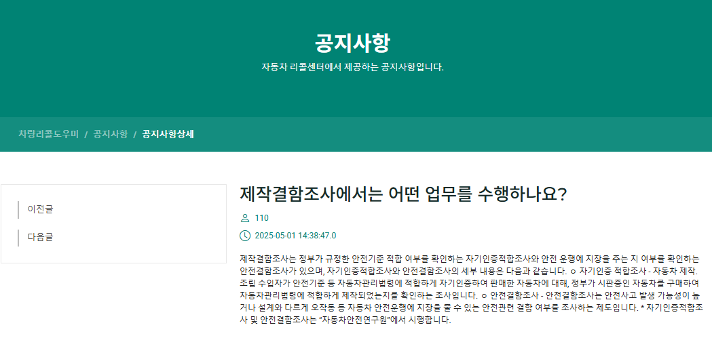
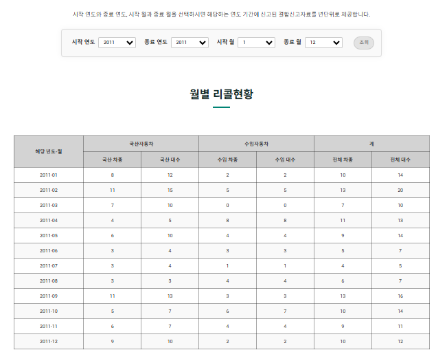
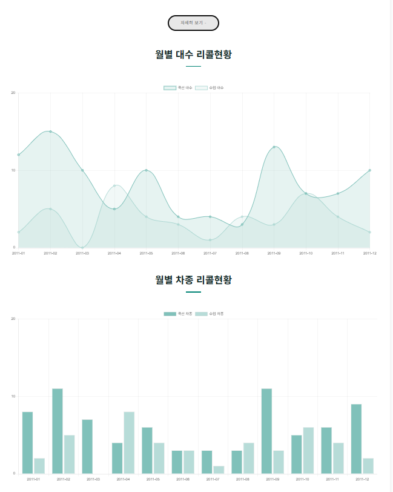

# KH아카데미 파일럿 프로젝트_차량 리콜 도우미
made by. team_KH리콜안전공단

 

기능 설명

## 메인

- 상단바
 - `차량리콜도우미` 클릭 시 메인화면으로 이동
 - `결함신고` 드랍다운 -> 결함신고 페이지로 이동
 - `결함신고` 드랍다운 -> 결함신고 리스트 페이지로 이동
 - `리콜센터` 드랍다운 -> 공지사항 페이지 이동
 - `리콜센터` 드랍다운 -> faq 페이지 이동
 - `리콜통계` 클릭 시 리콜통계 화면으로 이동
 - `관리자` 드랍다운 -> 결함신고검수 페이지로 이동
 - `관리자` 드랍다운 -> 공지사항등록 페이지 이동

- 페이지소개, 서비스 만족도, 지원 서비스, FAQ 클릭하면 인덱스 기능->하단 스크롤해 이동

### 메인-지원 서비스

- 각 버튼 클릭 시 nav와 같은 페이지들로 이동

### 리콜정보

- API를 이용한 데이터들을 10개씩 출력
- 페이징 클릭 시 `http://localhost:8485/recall_list?pageNum=6&amount=10` 형식으로 출력
- 최측 차량리콜도우미 클릭 시 메인화면으로 이동, nav 바 전부 적용

### 공지사항

- DB에서 테이블 정보를 가져와 출력
- 페이징 완료
- 서치 기능도 완료
- 글 선택 시 자세히보기로 들어가짐 

### 공지사항 상세

- 글제목, 번호, 작성시간, 공지사항 내용 출력
- 마지막 글인 경우 '다음글이 없습니다'
- 아닌 경우, 이전글 다음글 클릭하여 공지사항들 이동 가능

### FAQ

- 질문들을 출력, 클릭 시 토글되어 답변 확인 가능능
- 페이징 완료
- 서치 기능도 완료
- 아래 글작성 버튼 클릭 시 질문 작성 가능 

### FAQ작성

- 아래 글작성 버튼 클릭 시 질문 작성 기능 
- 작성시간 자동으로 값 선택됨

### 통계

- 월별 선택->month 이동 
- 연도별 선택->year 이동 
- 리콜현황, 제조사별 선택 시 인덱스 스크롤 이동

### 통계-연도

- 시작연도 ~ 종료연도 선택 후 조회 -> 해당 연도 신고 요약을 통계 표로 보여줌
- 자세히보기 클릭 시 토글기능
 

- 자세히보기 클릭 시 연도별로 표 제공
 

- 연도별로 선 그래프, 막대 그래프 제공
 

- 시작연도 ~ 종료연도 선택 후 조회 -> 제조사별 해당 연도 신고 요약을 통계 표로 보여줌
 

- 자세히보기 클릭 시 표 제공, 합산 + 클릭 시 연도별로 제공됨 
 

- 제조사별 도넛 그래프 제공

### 통계-월

- 시작연도 ~ 종료연도, 시작 월~ 종료 월 선택 후 조회 -> 해당 연도,월 신고 요약을 통계 표로 보여줌
- 자세히보기 클릭 시 토글기능
 

- 연도별로 선 그래프, 막대 그래프 제공
 

- 제조사별 해당 월, 연도 신고 요약을 통계 표로 보여줌
 

- 자세히보기 클릭 시 표 제공, 합산 + 클릭 시 연도- 월 별로 제공됨 
 

- 제조사별 도넛 그래프 제공

 

### 관리자 기능

- 공지사항 작성 기능
- 작성시간 자동으로 값 선택됨

 

### 관리자 기능

- 공지사항 작성 기능
- 작성시간 자동으로 값 선택됨
 

### 결함신고
 

`defect_reports.jsp`
- 좌측 상단에 홈페이지 명(로고)출력
- 상단에 목록 구현
- 페이지 중앙에 입력폼 작성
- 페이지 하단에 기본 목록태그 정리및 링크연결
 
`기능`
- 좌측상단 로고 클릭시 메인페이지 이동
- 입력폼 모두 작성시 확인페이지 이동
- 비밀번호 및 번호는 양식에 맞춰야 입력가능
 
 
### 결함신고 완료
 

`defect_reports_ok.jsp`
- 좌측 상단에 홈페이지 명(로고)출력
- 상단에 목록 구현
- 페이지 중앙에 확인폼 작성
- 페이지 하단에 기본 목록태그 정리및 링크연결
 

- `기능`
- 완료시 메인페이지 이동
- 신고후 리스트 확인페이지 이동
 
### 리콜정보검수

'defect_details_check.jsp'
- 좌측 상단에 홈페이지 명(로고)출력
- 상단에 목록 구현
- 페이지 중앙에 확인폼 작성
- 페이지 하단에 기본 목록태그 정리및 링크연결
 

`기능`
- 아이디를 관리자 입장에서 조회하여 자동입력(아이디,자동차제조사,자동차 모델명)
- 회사 옵션태그 사용시 해당 회사 번호 자동입력
- 검수완료시 리콜통계 테이블에 데이터 입력
- 검수완료시 리콜통계페이지 이동
-  

### 결함신고내역조회
 

- DB에서 테이블 정보를 가져와 출력
- 페이징 완료
- 서치 기능 완료
- 글 선택 시 해당 게시글로 이동

### 신고내역상세
 

- 해당 글 정보를 가져와 출력
- 수정버튼 클릭시 비밀번호 확인 페이지로 이동
- 목록버튼 클릭시 목록으로 이동

### 비밀번호 확인
 

- 해당 페이지의 입력받은 비밀번호 비교
- 해당 페이지의 id와 password값이 일치할 경우 수정 페이지로 이동
- 비밀번호 값이 없거나, 불일치시 경고창 출력

### 신고내역수정
 

- 해당 글 정보를 가져와 출력
- 수정 버튼 클릭시 수정 완료
- 삭제 버튼 클릭시 삭제

  

 
 

📅 2025/04/29 작업 내용

 

- **전국 리콜 현황 전체보기 기능 구현 완료** (`recall_list.jsp`)
  - ✅ 페이징 처리 완료
  - ❌ DB로 옮겨오는 방식 아님 — API 주소를 호출해서 바로 가져오는 방식
    - 수정예정
    - ⚠️ 총 개수(total) 구할 수 없어 **923개로 고정 처리**
  - 🎨 표 양식 CSS 적용 완료!

- **게시판 동작 프론트단 제작** (`announce.jsp,notice.jsp`)
  - 🎨 notice.jsp 프론트 완료 (CSS까지)
  - 🎨 announce 는 프론트 일시적 마무리, 추가 수정 예정 있음
  - ❌ 백앤드 구현 예정

- **결함신고 페이지** (`defect_reports.jsp`)
  - ✅ defect_reports.jsp - insert기능 완료
  - defect_details_check.jsp : 미완성 
   - 👉 (폼형식 관리자(는없지만)defect_reports 에 있는 글 검수하고 →defect_details로 insert 하는 페이지 )
  - ❌ 백앤드 기본틀 사용, 구현 예정, 프론트 수정필요

#### 🛠️ 추가 및 수정된 파일 목록

- `RecallController` (✏️)
- `Defect_DetailsDTO` (➕)
- `RecallService` (➕)
- `RecallServiceImpl` (➕)
- `recallstatic.xml` (➕)
  - 👉 PageServiceImpl: XML 파일 형식을 List로 변환하는 메소드 포함

------------------------------------

- `announce.jsp` (➕)
- `notice.jsp` (➕)
- `AnnounceController` (➕)
- `NoticeController` (➕)

------------------------------------

- `defect_reports.jsp` (➕)
- `defect_reports_ok.jsp` (➕)
- `DefectController` (➕)
- `NoticeController` (➕)
- `DefectDAO` (➕)
- `Defect_ReportsDTO` (➕)
- `DefactService` (➕)
- `DefactServiceImpl` (➕)

- `mybatis-config.xml` (✏️)

📅 2025/04/30 작업 내용

 

- **전국 리콜 통계** (`recall_statics.jsp`)
  - ✅ 연도별 통계처리 (연도선택> Defect_Reports 테이블 조회해서 차종,대수 등 표 형식 출력)
  - 📈 연도별 그래프 추가 완료
  - 📈 제조사별 표, 그래프 추가 완료
  - 📌TODO : 월별, 리콜현황, 결함신고 기능 구현 필요

  - 📌TODO : 전국 리콜 현황 전체보기(29일 만든 것) DB형식으로 교체 필요

- **결함신고 페이지** (`defect_reports.jsp`)
  - ✅ defect_reports.jsp : insert기능 보완(엉성했던 파트 수정)
  - `DefectController : detail부분 추가
  - defect_details_check.jsp : 관리자가defect_reports검수하고 진행중
  - 📌TODO : 버튼 클릭시 select된 내용 가지고와서 검수완료시-> detail table 에 insert되도록 기능구현 
  - 📌TODO : 프론트단 내일 할 예정 

- **신고내역조회 페이지** (`defectList.jsp`)
  - ✅ 신고 내역 리스트 출력 완료
  - ✅ 페이징 처리 완료
  - ✅ 검색 기능 완료
  - 🎨프론트단 완료
  - 📌Todo : 리스트에서 클릭시 이동할 게시글(defect_view) 만들 예정
  
#### 🛠️ 추가 및 수정된 파일 목록

- `DefectReportSummaryDTO` (➕)
- `recallstatic.xml` (➕)
- `RecallStaticDAO` (➕)
- `RecallController` (✏️)
- `RecallService` (✏️)
- `RecallServiceImpl` (✏️)

------------------------------------

- `defect_reports.jsp` (✏️)
- `defect_reports_ok.jsp` (✏️)
- `DefectController` (✏️)

------------------------------------

- `Criteria ` (✏️)
- `DefectListController` (➕)
- `DefectListDAO` (➕)
- `DefectListDTO ` (➕)
- `DefectListService ` (➕)
- `DefectListServiceImpl ` (➕)
- `DefectController` (➕)
- `PageController ` (✏️)
- `PageDAO ` (✏️)
- `PageService ` (✏️)
- `PageServiceImpl ` (✏️)
- `PageController ` (✏️)
- `defectList.jsp` (➕)
- `defectList.xml` (➕)
- `jquery-ui.js` (➕)
- `mybatis-config.xml` (✏️)
- `page.xml` (✏️)

#### 📌 내일 예정

- 🗃️전국 리콜 현황 전체보기(29일 만든 것) DB형식으로 교체
- 🛠️announce , qna 게시판 작업 마무리
- 🎨프론트 헤더, 푸터 단 제작하고 페이지 전체 적용
- 🐞디버그 픽스
- 🎨프론트 마무리
- 📚시연영상 촬영
- 📝서류 작업

📅 2025/05/01 작업 내용

 

- **전국 리콜 통계** (`recall_statics_month.jsp`)
  - ✅ 월별 리콜 통계 신고 현황,제조사별,그래프 구현 완료
  - ✏️ 리콜현황-월별 리콜현황-연도별로 구성
  - ✅ recall_statics -> recall_statics_year 이름 변경

   ~~전국 리콜 현황 전체보기(29일 만든 것) DB형식으로 교체~~
   - API 호출 방식으로 유지

- **Front-End** (`전체 jsp 단`)
  - ✅ header 테스트용으로 완료 -> announce 에 있음, 📌 TODO : 다른페이지들에도 적용할예정 
  - ✅ footer 링크걸기 완료!
   전국 리콜 현황 링크 : recall_list 
   📌id=aaa a href=#aaa 걸면 화면 움직이는거 가능 (넣을지 말지 고민)
   ✅announce_write 가는 버튼(관리자용)
   =>프론트엔드 적용 페이지들은 아래 정리 ! 

- **결함신고 페이지** (`defect_report.jsp,defect_details_check.jsp`)
  - ✅ 비밀번호 눈아이콘(적은 입력값 볼수있도록)
  - ✅ 자동차 결함신고 클릭시 폼제출및 조건달기(필히입력 전부-> 페이지이동)
  - ✅ 전화번호,휴대전화 형식, 비밀번호 정규식

  - ✅ 1.검색버튼 - defect_report table value값 가져오기
  - ✅ 2.검수완료 submit 및 defect_details input
  - ✅ 3.기간 형식 '240101~240505' 바꾸기
  - ✅ 4.contactinfo - select option태그값 형식 같이출력
    ex> [벤츠 코리아] 대표번호 : 000-0000

  - 📌TODO : 프론트단 index와 announce 비교하면서 적용예정
   관리자 페이지로 가는 defect_report _ok 필요하면 추후 경로수정 가능

- **신고내역조회 페이지** (`defectList.jsp`)
  - 📌Todo : 리스트에서 클릭시 이동할 게시글(defect_view) 제작중
  - 📌Todo : 비밀번호 입력 후 맞을 시 수정 기능 추가중

- **게시판 동작 프론트단 제작** (`announce.jsp,notice.jsp,announce_view.jsp`)
  - ✅ announce , announce_write 프론트 마무리
  - ✅ announce , announce_write 백앤드 구현 (insert, list, 페이징, 서치까지 완료)
  - ✅ announce_view 추가 구현 ( 내용 나오고, 다음페이지 이전페이지 , 프론트 디자인 완료 )
  
#### 🛠️ 추가 및 수정된 파일 목록

- `DefectReportSummaryDTO` (report_month추가✏️)
- `ManufacturerRecallDTO` (report_month추가✏️)
- `recall_statics_month.jsp` (➕)
- `recall_statics_year.jsp` (recall_statics에서 이름 변경✏️)
- `RecallController` (✏️)
- `RecallService` (✏️)
- `RecallServiceImpl` (✏️)
- `RecallStaticDAO` (✏️)
- `recallstatic.xml` ()

- `announce_view.jsp` (➕)
- `announce_write.jsp` (➕)
- `announce.jsp` (상단바 적용 완료!✏️)
- `notice_write.jsp` (➕)
- `notice.jsp` (✏️)
- `NoticeController` (✏️)
- `AnnounceController` (✏️)

- `AnnounceDTO` (➕)
- `FaqsDTO` (➕)
- `mybatis-config` (✏️)
- `FaqannServiceImpl` (➕)
- `FaqannService` (➕)
- `FaqannService` (➕)
- `faqann.xml` (➕)
- `FaqannDAO` (➕)
- `main.jsp` (➕)

------------------------------------

- `defect_reports.jsp` (✏️)
- `defect_details_check.jsp` (✏️)
- `defect_reports_ok.jsp` (✏️)
- `DefectController.java` (✏️)
- `DefectDAO.java` (✏️)
- `DefactService.java` (✏️)
- `DefactServiceImpl.java` (✏️)
- `defect.xml` (✏️)

------------------------------------

- **Front-End 적용 페이지**
footer/header/ol li 링크 적용 완료

- `announce.jsp` (✏️)
- `notice.jsp` (✏️)
- `announce_view.jsp` (✏️)
- `announce_write.jsp` (✏️)
- `main.jsp` (디자인 필요✏️)
- `notice_write.jsp` (✏️)
- `recall_list.jsp` (✏️)
- `recall_statics_year.jsp` (✏️)
- `recall_statics_month.jsp` (✏️)

- `defect_reports.jsp` (✏️)
- `defect_details_check.jsp` (✏️)
- `defect_reports_ok.jsp` (✏️)

#### 📌 내일 예정

- 메인 만들기
- 취합
- 시간 남으면 소스트리 공부
- 🐞디버그 픽스
- 📚시연영상 촬영
- 📝서류 작업

📅 2025/05/02 작업 내용

 

- **신고내역조회 페이지** (`defectList.jsp`)
  - ✅ 1.해당 게시글 조회, 수정, 삭제 기능 완료
  - ✅ 2.비밀번호 체크 기능 완료
  - ✅ 3.프론트엔드 header, footer, nav 적용 모두 완료

- **마무리 작업** 
  -  기능분류, 캡쳐, 깃허브 작성
  -  ✅ 메인단 디자인 완료!
  -  ✅ 신고내역조회 페이지 취합 완료! 
  - 🐞 디버그 픽스
  - 📚 시연영상 촬영
  - 📝 서류 작업

#### 🛠️ 추가 및 수정된 파일 목록

🐞✅ nav바 버그 확인 => 페이지들 전체 링크 수정  
- `announce.jsp` (✏️)
- `notice.jsp` (✏️)
- `announce_view.jsp` (✏️)
- `announce_write.jsp` (✏️)
- `main.jsp` (디자인 필요✏️)
- `notice_write.jsp` (✏️)
- `recall_list.jsp` (✏️)
- `recall_statics_year.jsp` (✏️)
- `recall_statics_month.jsp` (✏️)
- `defect_reports.jsp` (li링크 수정✏️)
- `defect_details_check.jsp` (✏️)
- `defect_reports_ok.jsp` (확인완료 버튼 수정✏️)

< 재수정 >

- `defect_reports` 문구수정
- `recall_statics_year.jsp` 문구수정
- `recall_statics_month.jsp`  문구수정
- `notice_write.jsp` 버튼수정
- `main.jsp` 제작완료
- `AnnounceController` (메인에 faq 추가)

<이미지 업로드>
image1~2

< 클라이언트 폴더>
image3 ~ 10

< 참고용 페이지들 삭제 완료!>

- 🐞마지막 디버깅
 - ✅임포트 정리
 - `defectList.xml` modify 수정
 - `defect_reports.jsp` 비밀번호 수정
 - `DefectController` main 이동 수정
- `defectList.xml` 버그수정

